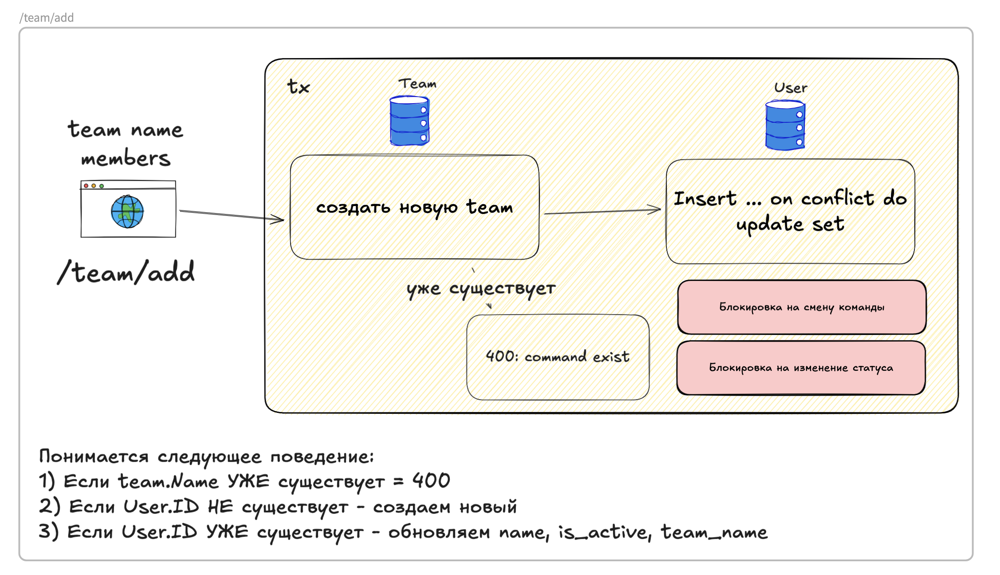
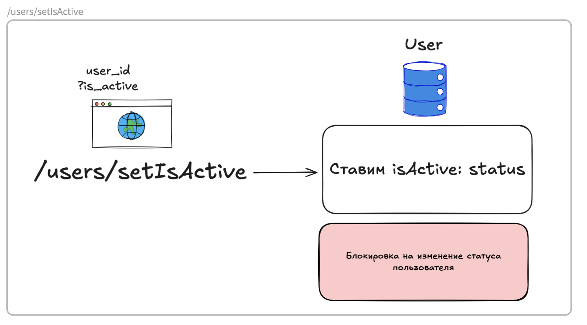
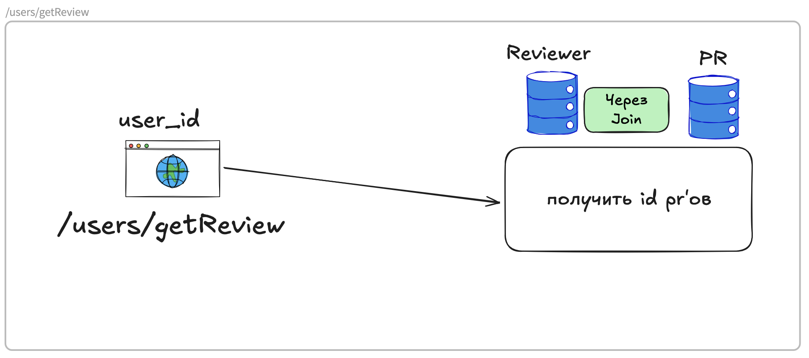
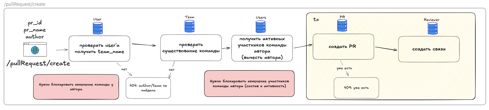
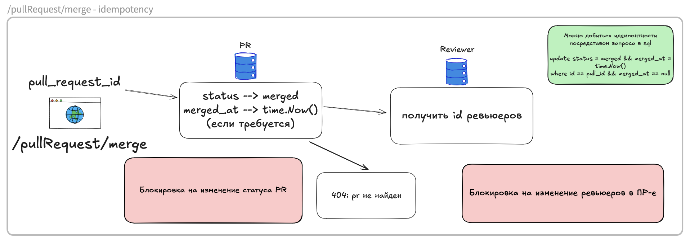
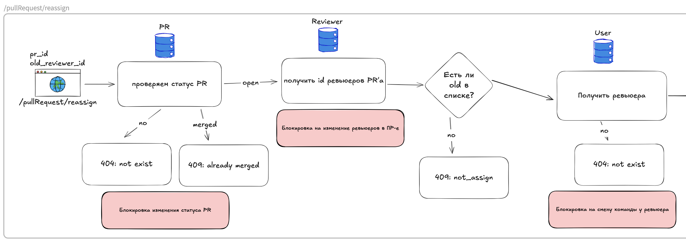
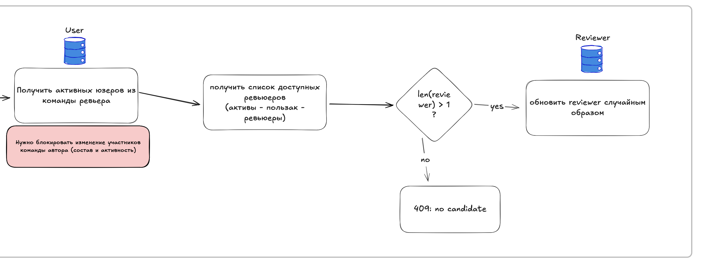
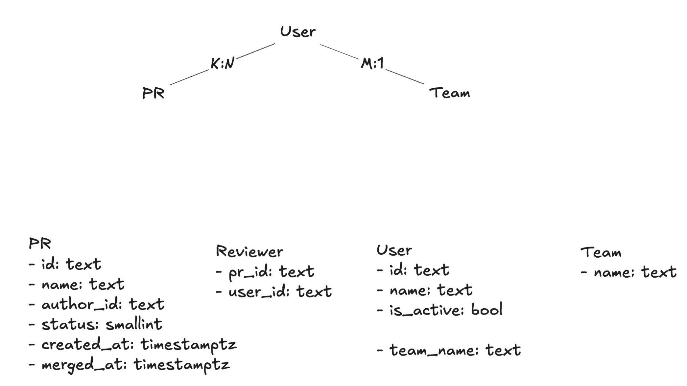
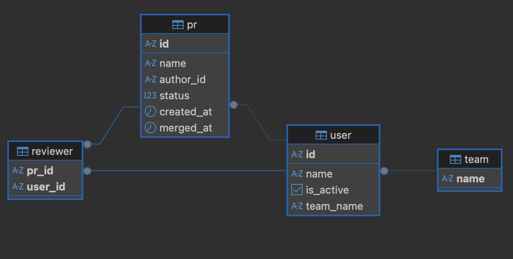

# Запуск
`docker compose up -d`

Сервис запустится на `8080` порту. Можно настроить в .env (`SERVICE_URL`)

Конфигурация берется из `.env`

# Вопросы и комментарии

1. Может ли пользователь быть в 2 командах? — Нет, т.к. в ручке /users/setIsActive в ответе User имеет одну команду (поле типа string). Соотношение User - Team — 1 ко многим. 
2. Делать ли отдельную таблицу для Team? — Да, в случае, если захотим добавить команде аттрибутов, это будет легко сделать
3. Просто баним (isActive=false) пользователя или баним и переназначаем в ПР-ах? Просто баним, тк есть ручка reassign, ревьюеру не всегда может быть найдена замена. Были предприняты попытки спроектировать флоу, при котором переназначение происходит автоматически, но в таком случае флоу сильно увелечиваются в размерах и сложности, можем не уложиться в требования
4. Посокольку никаких требований по сортировке выходных данных не предъявлялось, она не произовдилась
5. Ошибка в задании в последней ручке reassign: в openapi в примере old_reviewer_id вместо old_user_id, как в схеме. В коде ожидается old_user_id

# Конфигурация линтера
Линтер golangci.
Запуск командой `make style`

Конфигурация включает в себя:

Форматеры:
1. goimports - автоматически организует импорты
2. gofumpt - строгий форматтер кода

Линтеры
1. errcheck - проверяет обработку ошибок
2. govet - статический анализ, находит подозрительные конструкции
3. staticcheck - продвинутый статический анализ (все проверки кроме SA1019)
4. unused - находит неиспользуемый код
5. gocritic - предлагает улучшения стиля кода
6. gocyclo - проверяет цикломатическую сложность функций (порог: 15)

# Дополнительная информация
Перед написанием кода были спроектированы флоу для всех ручек. Для корректной работы, поддержания консистентности и избежания гонки данных, предусматривалось сделать блокировки на уровне строк, но из-за ограниченного количества времени не все задуманное удалось реализовать. Там, где необходимо, использованы транзакции, которые в коде выполняются с помощью менеджера транзакций
1. /team/add 
2. /team/get 
3. /users/setIsActive 
4. /users/getReview 
5. /pullRequest/create 
6. /pullRequest/merge 
7. /pullRequest/reassign 

   
   

В БД для запросов активных пользователей по команде создан индекс

Схема БД:

Стек:
- Go, Postgres, ogen (генерация командой `make codegen`), goose для миграций, squirrel для билда запросов
